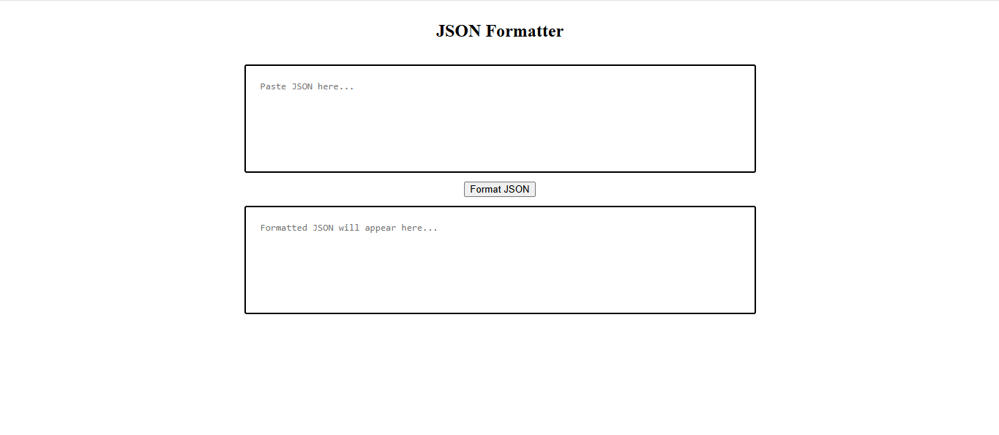
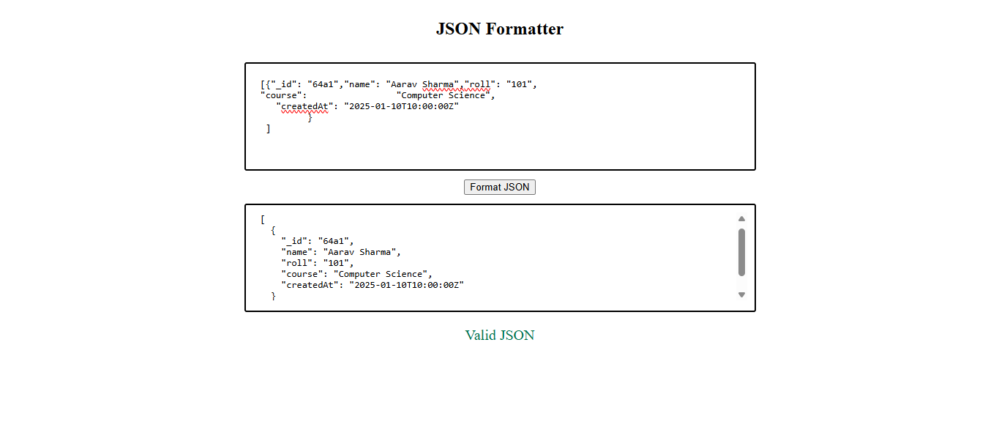
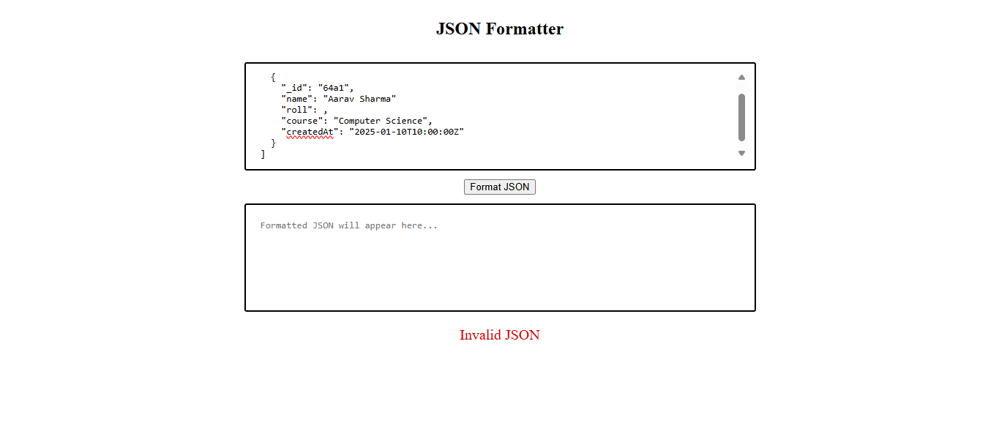

# JSON Formatter & Validator

## Description
A lightweight web application that formats and validates JSON data. It helps developers quickly detect errors and convert raw JSON into a clean, readable structure.

## Screenshots
### Main

### Valid JSON

### InValid JSON

## Features
- Format JSON with proper indentation
- Validate JSON input instantly
- Error handling for invalid JSON
- Clean and minimal UI
- Fast processing using built-in JavaScript methods

## Tech Stack
- HTML
- CSS
- JavaScript

## How to Run
1. Clone the repository
2. Open `index.html` in your browser
3. Paste JSON and click "Format"

## Future Improvements
- Add copy-to-clipboard button
- Add JSON minifier
- Add file upload support (.json)
- Add dark/light mode toggle
